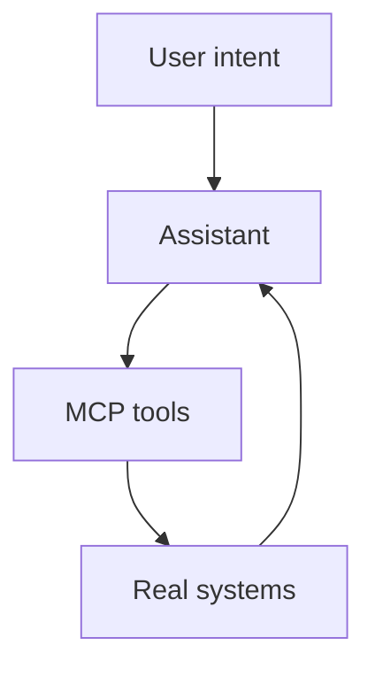

# MCP

**Model Context Protocol** is how assistants stop guessing and start *using* systems — with clear tool boundaries.

## Why it matters for builders

Prompts alone don’t scale. Tools do:

> [!tip]
> Prefer a boring tool with a clear contract over a clever prompt that sometimes works.

## Design rules I use

1. One tool = one job
2. Inputs are typed; failures are readable
3. Mutating tools need human-visible confirmation for risky actions

Related thinking: [[AI Agents]], [[Prompt Engineering]], [[Claude Code]].

## Demo table

| Capability | Prompt-only | With MCP |
|------------|-------------|----------|
| Read calendar | Paste text | Query live |
| Publish note | Describe steps | Call publish |
| Audit links | Manual | Tool scan |

## See also

- [[AI Agents]]
- [[Share exactly what you see in Obsidian]]
- [[One Person Company]]
