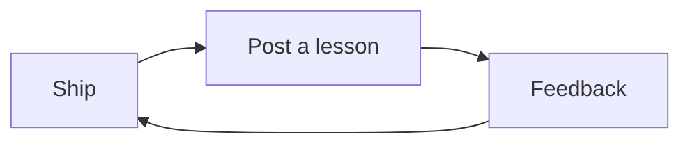

# Build in Public

Building in public is a distribution habit, not a personality type. Share **progress that teaches**, not every mood.

## What to publish

- Decisions and what you cut
- Screenshots of real workflows
- Lessons after shipping — not before

> [!example]
> “We removed accounts from publish” teaches more than “Excited for the journey 🚀”.

## Cadence that doesn’t burn you out

- Weekly: one artifact (note, clip, changelog)
- Monthly: one deeper essay in the [[Digital Garden]]
- Always: link back to a living note like [[AI Product Development]]

## See also

- [[Personal Branding]]
- [[Audience Building]]
- [[One Person Company]]
- [[Prompt Engineering]]
