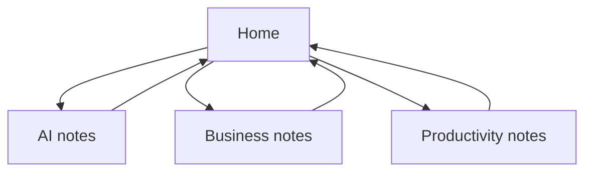

# Digital Garden

A digital garden is a public knowledge space that grows by linking — closer to a wiki than a blog timeline.

## What visitors should feel

- They can enter from [[index]]
- They can wander via wikilinks
- They can orient with search, backlinks, and graph

> [!success]
> Folder publish turns this structure into a site. Same Markdown — new surface.

## Contrast with a single note

| | Share a note | Digital garden |
|--|--------------|----------------|
| Unit | One URL | Many linked pages |
| Best for | Essays, announcements | Docs, courses, PKM |
| Demo note | [[Share exactly what you see in Obsidian]] | This folder |

## See also

- [[Knowledge Management]]
- [[Second Brain]]
- [[Build in Public]]
- [[Audience Building]]
