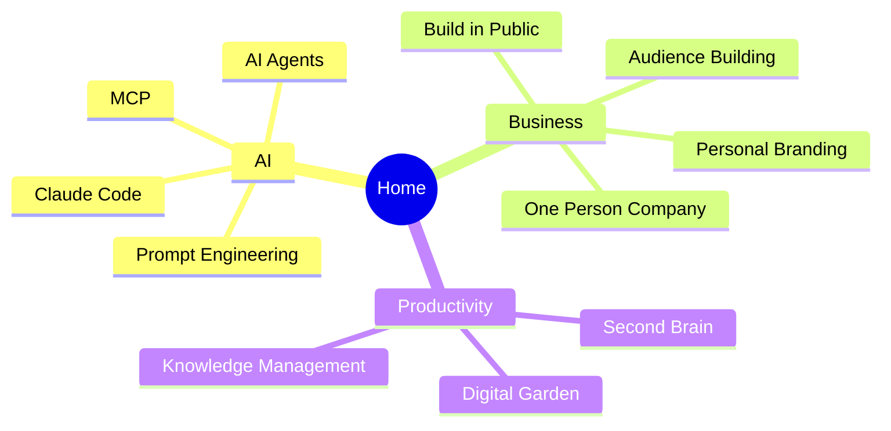

# Digital Garden

> Turn a folder into a digital garden

Welcome — this folder is a small, living map of how I think about AI, building in public, and personal knowledge.

This is the page you’d open after **Publish Folder**. From here you can wander by topic, search, or open the graph.

![[obsidian+mdfriday.png]]
## Start here

| Path | What’s inside |
|------|----------------|
| [[Prompt Engineering\|AI]] | Prompts, agents, tools, Claude Code |
| [[One Person Company\|Business]] | Solo company, audience, branding |
| [[Second Brain\|Productivity]] | PKM, gardens, knowledge habits |

## How this garden is meant to be used

1. Open a note that matches your current question
2. Follow `[[wikilinks]]` when something sparks
3. Use **Backlinks** to see what points here
4. Open **Graph** when you want the map, not the path

> [!abstract] Why a garden, not a blog
> A blog is a stream. A garden is a map. Notes grow links over time — see [[Digital Garden]].

## Featured note for demos

For single-note publishing and theme comparisons, use [[Share exactly what you see in Obsidian]] in `Share Note`.

## See also

- [[Knowledge Management]]
- [[Build in Public]]
- [[AI Agents]]
