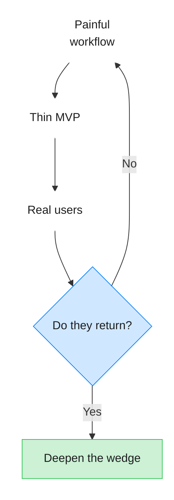

# AI Product Development

> A working note on shipping AI products as a solo founder — from idea to first users.

![[ai-dev.jpg]]
## The real loop

Most AI products fail the same way: a clever demo, then silence. The loop that actually works is shorter and less romantic:

1. Pick one painful workflow
2. Ship a thin slice that removes the pain
3. Watch real people use it
4. Cut what they ignore



> [!tip] Ship before you feel ready
> If the note is clear enough to publish, the product is clear enough to demo.

## What “good enough” looks like

| Stage  | Signal                               | Don’t wait for      |
| ------ | ------------------------------------ | ------------------- |
| Idea   | One sentence a stranger understands  | Perfect positioning |
| MVP    | Someone finishes the job without you | Feature parity      |
| Growth | Users invite others                  | Viral loops         |

## A practical stack for solo builders

- **Write** in [[Second Brain|Obsidian]] — thinking stays local
- **Publish** with MDFriday — one note or a whole garden
- **Talk** in public via [[Build in Public]]
- **Assist** with [[Claude Code]] and [[AI Agents]] for leverage

```ts
// Sketch: publish when the note is ready, not when the site is perfect
export type PublishTarget = "note" | "garden";

export function publish(path: string, target: PublishTarget) {
  return { path, target, ok: true };
}
```

## Math that keeps you honest

If revenue is \(R\) and cost is \(C\):

$$
ROI = \frac{R - C}{C}
$$

For early AI products, track **time saved per session** before you track ROI. Users feel time first.

## Checklist for this week

- [x] Name the one workflow
- [x] Write the public note (this one)
- [ ] Record a 60-second demo
- [ ] Get five strangers to try it
- [ ] Cut one feature nobody used

## See also

- [[Prompt Engineering]]
- [[MCP]]
- [[One Person Company]]
- [[Personal Branding]]
- [[Digital Garden]]

> [!quote]
> Clarity compounds. Ship the clearest version you can explain in one screen.

## AI History
```timeline
[line-3, body-2]

+ 2022</br> Generative AI
+ AI Goes Mainstream
+ ChatGPT brought generative AI to hundreds of millions of people. AI shifted from specialized tools to general-purpose assistants capable of writing, coding, reasoning, and creating.

+ Today</br> AI Product Development
+ From Features to AI-Native Products
+ AI is becoming part of the product itself. Developers can now use AI to research problems, write code, generate interfaces, test products, and iterate rapidly—changing how software is built.
```