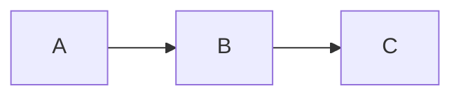

# MDFriday Demo Vault Design Specification

## Overview

The MDFriday Demo Vault is the official demonstration vault used across:

- MDFriday Website
    
- Product Documentation
    
- GitHub Repository
    
- YouTube Videos
    
- Bilibili Videos
    
- Screenshots
    
- Marketing Materials
    
- Automated Compatibility Testing
    

The vault serves as a single source of truth for demonstrating MDFriday capabilities.

Its purpose is not to provide useful knowledge content.

Its purpose is to clearly demonstrate:

1. Obsidian compatibility
    
2. Publishing workflow
    
3. Theme capabilities
    
4. Digital Garden capabilities
    
5. Real-world usage scenarios
    

The same vault should be reusable across all product demonstrations.

---

# Design Principles

## 1. Content Must Feel Real

Avoid placeholder content such as:

```markdown
# My Note

Hello World

This is a demo note.
```

The vault should feel like a real knowledge base maintained by a real creator.

Preferred topics:

- AI
    
- Personal Knowledge Management
    
- Build in Public
    
- One Person Company
    
- Personal Branding
    
- Product Development
    
- Digital Garden
    
- Content Creation
    

These topics align closely with MDFriday's target audience.

---

## 2. Content Must Showcase Obsidian Features

Every major Obsidian feature should appear somewhere inside the vault.

Examples:

- Headings
    
- Lists
    
- Tables
    
- Callouts
    
- Images
    
- Wikilinks
    
- Tags
    
- Code Blocks
    
- Mermaid
    
- LaTeX
    
- Task Lists
    
- Quotes
    
- Frontmatter
    

The vault should function as a compatibility showcase.

---

## 3. Content Must Support Video Recording

The vault should be optimized for product videos.

A viewer should immediately understand:

- What is being published
    
- Why it is useful
    
- What result is generated
    

Avoid overly technical notes that require extensive reading.

Notes should be visually rich and easy to scan.

---

## 4. Content Must Support Theme Demonstration

The same note should look good under multiple themes.

Avoid notes that rely only on plain text.

Include:

- Images
    
- Tables
    
- Callouts
    
- Quotes
    
- Code
    
- Diagrams
    

This allows theme differences to become obvious.

---

## 5. Content Must Support Digital Garden Demonstration

The folder structure should naturally demonstrate:

- Navigation
    
- Wikilinks
    
- Backlinks
    
- Search
    
- Graph View
    

Relationships between notes should be intentionally designed.

---

# Primary Demo Scenarios

The vault must support three core demonstrations.

## Scenario 1: Share a Note

Purpose:

Show how a single note can be published instantly.

Workflow:

```text
Open Note
→ Right Click
→ Publish
→ Open URL
```

The note should demonstrate:

- Rich formatting
    
- Images
    
- Code
    
- Tables
    
- Callouts
    
- Mermaid
    
- LaTeX
    

Recommended note:

```text
AI Product Development.md
```

---

## Scenario 2: Note Themes

Purpose:

Show how the same content can be rendered using different themes.

Workflow:

```text
Same Note
→ Theme A
→ Theme B
→ Theme C
```

The note used in Scenario 1 should also be used here.

This allows users to focus on visual differences.

---

## Scenario 3: Digital Garden

Purpose:

Show how a folder becomes a navigable website.

Workflow:

```text
Folder
→ Publish Folder
→ Quartz Site
→ Navigation
→ Search
→ Graph
```

The folder structure should contain meaningful relationships between notes.

---

# Recommended Vault Structure

```text
MDFriday Demo Vault

├── Share Note
│   └── AI Product Development.md
│
├── Digital Garden
│   │
│   ├── Home.md
│   │
│   ├── AI
│   │   ├── Prompt Engineering.md
│   │   ├── Claude Code.md
│   │   ├── MCP.md
│   │   └── AI Agents.md
│   │
│   ├── Business
│   │   ├── One Person Company.md
│   │   ├── Build in Public.md
│   │   ├── Personal Branding.md
│   │   └── Audience Building.md
│   │
│   └── Productivity
│       ├── Second Brain.md
│       ├── Knowledge Management.md
│       └── Digital Garden.md
│
├── Assets
│   ├── cover.png
│   ├── architecture.png
│   └── workflow.png
│
└── Templates
    └── Article Template.md
```

---

# Required Internal Linking

Notes should contain extensive wikilinks.

Example:

```markdown
See also:

- [[Prompt Engineering]]
- [[Claude Code]]
- [[AI Agents]]
```

The graph should look connected.

Avoid isolated notes.

Every note should link to at least two other notes.

---

# Required Demonstration Features

The vault must include examples of:

## Frontmatter

```yaml
---
title: Example Note
tags:
  - ai
  - knowledge
---
```

## Callouts

```markdown
> [!tip]
> Ship before you feel ready.
```

## Tasks

```markdown
- [x] Launch MVP
- [ ] Get first 100 users
```

## Tables

```markdown
| Tool | Purpose |
|------|---------|
| Obsidian | Writing |
| MDFriday | Publishing |
```

## Code Blocks

```ts
export function publish() {
  return true
}
```

## Mermaid



## LaTeX

$$
ROI = \frac{Revenue - Cost}{Cost}
$$

## Images

At least one image should be included.

---

# Content Style

Preferred writing style:

- Practical
    
- Creator-focused
    
- Easy to read
    
- Evergreen
    

Avoid:

- Academic writing
    
- Fiction
    
- Lorem Ipsum
    
- Placeholder text
    
- Empty notes
    

Every note should feel publishable.

---

# Success Criteria

The Demo Vault is successful if a new user can:

1. Understand what MDFriday does within 30 seconds.
    
2. Understand the difference between Note Publishing and Digital Garden Publishing.
    
3. See Obsidian compatibility immediately.
    
4. See the value of themes.
    
5. Understand how knowledge becomes a website.
    

The Demo Vault should function as both a product showcase and a realistic example knowledge base.