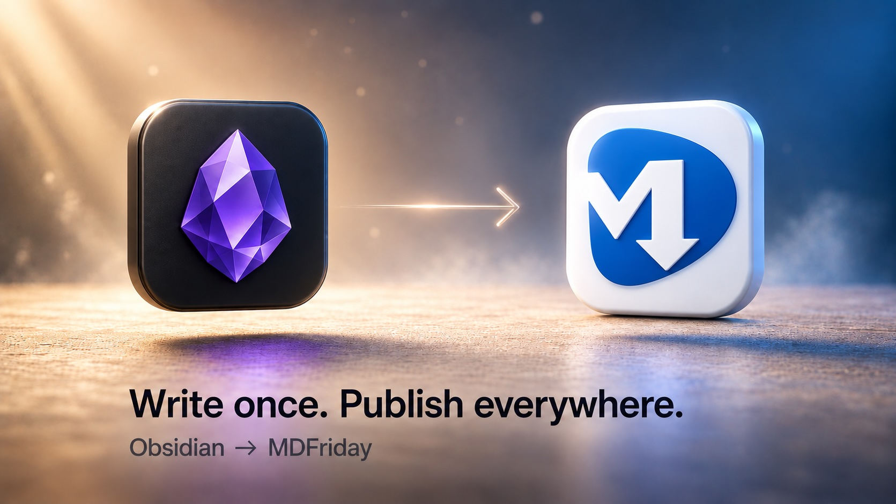
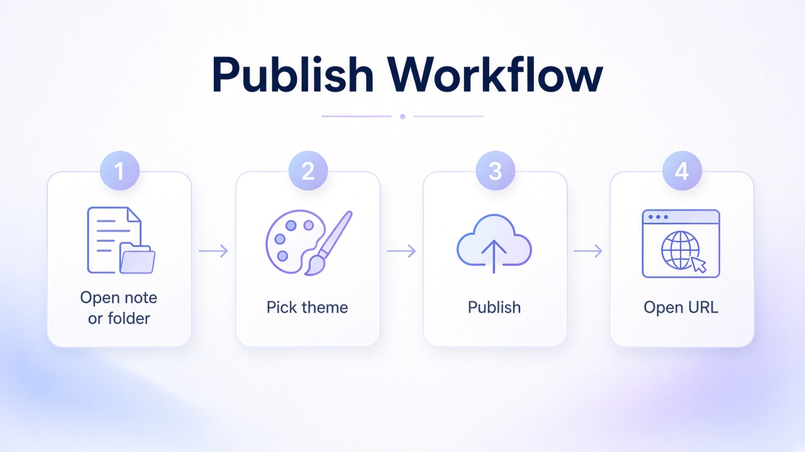
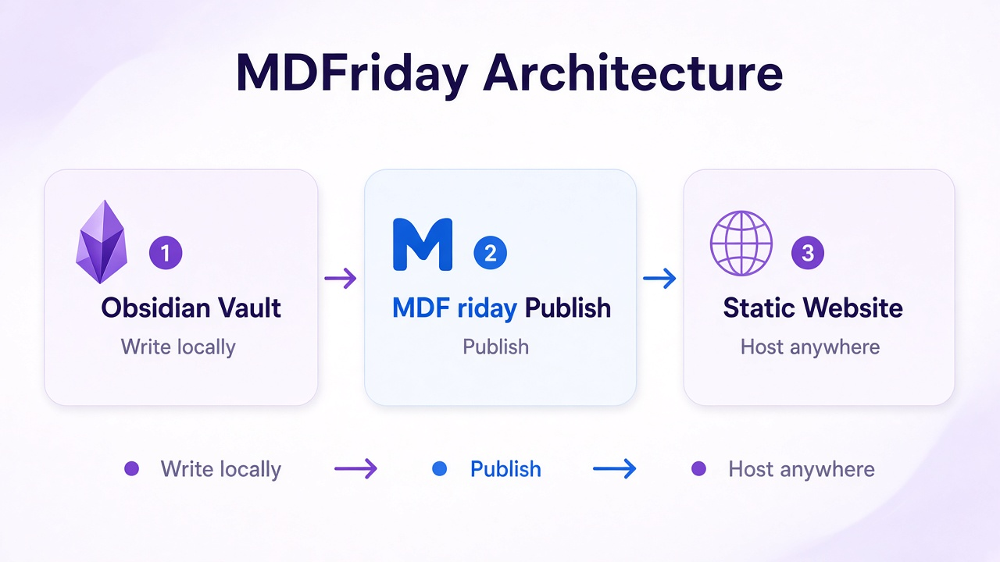

# Markdown Syntax Showcase

A single note built from **standard Markdown** — the kind every custom theme has to render well. Use this page when you compare themes: same content, different skin.



---

## Why this note exists

Theme demos fail when the sample is too thin. Plain “Hello World” hides typography, spacing, and color tokens. This note packs the common building blocks into one scannable article about writing in public.

> Themes don’t invent content. They reveal how carefully the content was structured.

---

## Emphasis and inline marks

You can mix *italic*, **bold**, ***bold italic***, and `inline code` in one sentence.

Strikethrough is also common in drafts: ~~ship Friday~~ ship when the note is clear.

Links keep the garden connected: [MDFriday](https://fsky.top/) · related thinking in [[AI Product Development]].

---

## Headings set the rhythm

### Section for scanning

Readers jump by heading. Themes that scale type well make long notes feel short.

#### Detail level

Keep H4+ rare. If you need five levels, the note probably wants a split.

---

## Lists

Unordered:

- Capture the idea
- Link it twice
- Publish the clearest version

Ordered:

1. Open the note
2. Pick a custom theme
3. Publish and open the URL

Task list (still Markdown-flavored, widely supported):

- [x] Write the showcase note
- [x] Attach one image
- [ ] Record the theme comparison clip

Nested:

- Writing
  - Draft in Obsidian
  - Edit for strangers
- Publishing
  - Single note
  - Folder garden

---

## Quote

> Clarity compounds. If a stranger can skim this page in thirty seconds, the theme has something real to style.

---

## Table

| Element | What themes style | What you check on camera |
|---------|-------------------|---------------------------|
| Headings | Size, weight, color | Hierarchy at a glance |
| Tables | Borders, zebra, padding | Readable on a phone |
| Code | Background, radius | Contrast for recording |
| Quotes | Bar, italic, tint | Separates voice from body |

---

## Code

Inline: run `publish(note)` when the draft is done.

Fenced block:

```markdown
# Title

A short paragraph.

- One
- Two
```

```ts
type ThemeDemo = {
  note: string;
  theme: "custom" | "notes" | "wiki";
};

export function preview(demo: ThemeDemo) {
  return `${demo.theme}:${demo.note}`;
}
```

---

## Horizontal rule

Above and below this line are thematic breaks. Themes often draw them as soft dividers.

---

## Image + caption pattern



*Figure: same Markdown, different theme chrome — keep the screenshot path relative so publish stays portable.*

Architecture for the wider product story:



---

## Checklist for the theme video

1. Open **this note** in Obsidian  
2. Publish with **Theme A** → screenshot  
3. Same note, **Theme B** → screenshot  
4. Same note, **Theme C** → screenshot  
5. Cut a side-by-side — content identical, look different  

> [!tip]
> Keep narration on visuals: fonts, spacing, callout color, code contrast. Don’t reread the whole article on camera.

---

## See also

- [[AI Product Development]] — richer Obsidian-flavored demo (callouts, Mermaid, LaTeX)
- [[Digital Garden]] — when one note becomes a folder site
- [[Personal Branding]] — why the published page should still sound like you

---

*Standard Markdown · Share Note · custom theme demo*
