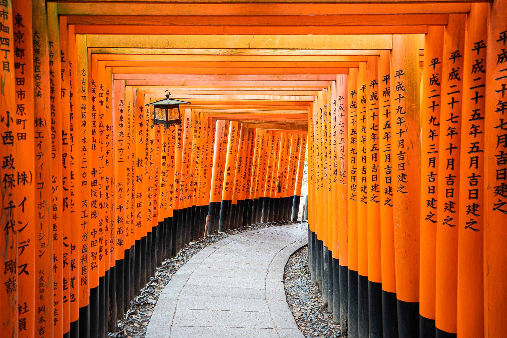

# Japan Trip Plan — Tokyo · Kyoto · Osaka

A practical itinerary for a **7-day** first trip: walkable days, fewer hotel hops, and enough buffer for trains and jet lag.

---

## Snapshot

| **When**        | Mid-November (cooler, fewer extreme crowds than Golden Week) |
| --------------- | ------------------------------------------------------------ |
| **Who**         | 2 adults                                                     |
| **Style**       | Food + neighborhoods + one day trip                          |
| **Base cities** | Tokyo (3N) → Kyoto (2N) → Osaka (1N) → fly out               |

**Budget ballpark (per person, excluding flights):** ¥80,000–120,000 for hotels + local transit + meals, if you mix convenience-store breakfasts with one nicer dinner a day.

---

## Goals (keep these visible)

1. Eat well without booking every meal
2. See *one* “classic” site per city, then wander
3. Leave empty afternoons — Japan rewards side streets

If a day feels tight, cut the attraction, not the meal.

---

## Before you go

### Book / buy

- [ ] Flights + hotels (cancelable rates if dates might slip)
- [ ] [Japan Visitor Web](https://www.vjw.digital.go.jp/) / entry docs as required at the time
- [ ] IC card plan: Welcome Suica / Pasmo Passport *or* buy on arrival
- [ ] Pocket Wi‑Fi **or** eSIM
- [ ] Seat reservations if you take a timed Shinkansen at rush hours

### Pack light

- Comfortable shoes (10k+ steps/day is normal)
- Compact umbrella
- Reusable bag for konbini runs
- Power: Type A plug; bring a short USB-C cable

---

## Day by day

### Day 0 — Arrive Tokyo (Haneda / Narita)

- Airport → hotel (train or limousine bus)
- Neighborhood walk + **konbini** dinner if you land late
- Sleep early; don’t force a big first night

**Stay:** Shinjuku or near a Yamanote station (easy transfers)

### Day 1 — Tokyo west side

**Morning**

1. Shinjuku — viewpoint *or* just the scramble energy
2. Coffee + people-watching

**Afternoon**

- Shibuya → Yoyogi / Harajuku side streets
- Meiji Jingu if you want one quiet reset

**Evening**

- Izakaya near the hotel — order small plates, don’t over-plan

### Day 2 — Tokyo east / classic + neighborhood

**Morning:** Asakusa (Senso-ji early beats tour groups)

**Afternoon:** pick *one*

- TeamLab-style museum ticket **or**
- Kiyosumi / Kuramae cafe hopping **or**
- Akihabara only if you actually care about it

**Evening:** Omoide Yokocho / nonbei alley vibes in Shinjuku — go early for seats

### Day 3 — Tokyo → Kyoto (Shinkansen)

| Step | Notes |
|------|--------|
| Luggage | Send ahead via hotel takkyubin *or* use coin lockers |
| Train | Tokyo → Kyoto (~2h15 on Nozomi/Hikari) |
| Arrive | Check in, then **Gion** at dusk (walk, don’t chase geisha photos) |

Light dinner near Kawaramachi. Save Fushimi for tomorrow morning.

### Day 4 — Kyoto essentials (slow)

**Morning:** Fushimi Inari — start early, turn around when the crowd thickens (you don’t owe the summit)

**Midday:** Matcha + tofu lunch in the area or back toward central Kyoto

**Afternoon:** pick *one* temple cluster

- Kiyomizu-dera + Sannenzaka **or**
- Arashiyama (bamboo is photogenic; go late afternoon if you hate crowds)

**Evening:** Nishiki Market for grazing, then a proper dinner reservation if it’s a special night

### Day 5 — Kyoto → Osaka

**Morning:** Philosopher’s Path *or* a quiet shrine if Day 4 was crowded

**Midday:** Shinkansen/special rapid to Osaka (~15–30 min depending on service)

**Afternoon:** Nakazaki-cho cafes **or** Osaka Castle park (exterior is enough for many people)

**Evening:** Dotonbori for the lights — eat **one** signature thing (takoyaki / okonomiyaki), not five

**Stay:** Namba or Umeda depending on next day’s exit airport

### Day 6 — Osaka buffer / day trip option

Choose based on energy:

**Option A — City food day**

- Kuromon Market morning
- Shopping in Shinsaibashi
- Early night before travel day

**Option B — Nara day trip**

- Osaka → Nara
- Park + Todai-ji
- Back by evening

### Day 7 — Depart

- IC card refund / leftover yen for gifts at the airport
- Build **3 hours** airport buffer for international flights

---

## Food shortlist (edit as you go)

**Tokyo**

- One bowl of solid ramen (neighborhood > famous queue when jet-lagged)
- Conveyor-belt sushi once for fun, once “proper” if budget allows
- Convenience-store egg sandwich — seriously

**Kyoto**

- Tofu / yudofu lunch
- Matcha soft serve (tourist, still worth it once)

**Osaka**

- Okonomiyaki
- Kushikatsu (one place is enough)

---

## Money & transit notes

- **Cash** still helps at tiny restaurants; cards are fine in most cities
- Tap IC everywhere for metro/bus
- Shinkansen: keep the ticket until the gate eats it
- Tax-free: passport at eligible shops; don’t open sealed bags early

---

## Shared packing checklist

- [ ] Passports + backups (photo in cloud)
- [ ] Hotel confirmations offline
- [ ] Medicines / spare glasses
- [ ] 10× socks (laundry mid-trip if needed)
- [ ] Small gifts for hosts / coworkers

---

## Open questions

1. Haneda vs Narita — which is cheaper with luggage transfer time?
2. Do we want one kaiseki night in Kyoto (book ahead)?
3. Suitcase send Kyoto→Osaka hotel — yes/no?

---

## After the trip

Turn photos into a short published note (same Markdown, public URL) — good excuse to reuse this page as a template for the next country.

Related vault notes: [[Markdown Syntax Showcase]] · [[Share exactly what you see in Obsidian]]

---

*Share Note demo · native Markdown · real travel scenario*
