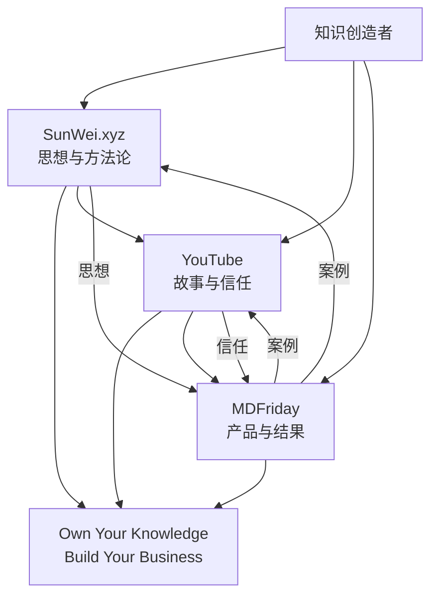

你目前最适合的结构，其实是：

> **Sun Wei（人） → YouTube（信任） → MDFriday（产品）**

人负责思想和信任，产品负责交付结果。很多 SaaS Founder 早期都是这个模式：Founder Brand 建立信任，公司品牌承接需求。([James Schramko](https://www.jamesschramko.com/playbooks/personal-brand-vs-business-brand/?utm_source=chatgpt.com "Personal Brand vs Business Brand | James Schramko"))

|                 | **SunWei.xyz**                          | **YouTube**                 | **MDFriday.com**                     |
| --------------- | --------------------------------------- | --------------------------- | ------------------------------------ |
| **定位**          | Founder Brand思想总部（Digital HQ）           | Trust Engine记录旅程与建立信任       | Product Brand交付解决方案                  |
| **核心问题**        | 为什么（Why）                                | 如何实践（How）                   | 用什么实现（What）                          |
| **使命**          | 帮助知识创造者掌控知识资产，并建立自己的事业                  | 展示这条路真实是怎么走的                | 帮助用户把笔记变成网站                          |
| **品牌口号**        | Own Your Knowledge.Build Your Business. | Building MDFriday in Public | One click. Turn notes into websites. |
| **目标用户**        | 知识工作者、创作者、独立开发者                         | 对 AI、一人公司、创业感兴趣的人           | Obsidian / Markdown 用户               |
| **核心资产**        | 认知与方法论                                  | 信任与故事                       | 产品与案例                                |
| **主要内容形式**      | 长文、思考、路线图                               | 视频、Vlog、复盘                  | 文档、案例、产品内容                           |
| **成功指标**        | 订阅、邮件列表、品牌认知                            | 订阅、观看时长、互动                  | Trial、付费用户、续费                        |
| **未来 10 年是否会变** | 基本不会                                    | 基本不会                        | 很可能会持续进化                             |

---

## SunWei.xyz 话题

|主题|示例内容|
|---|---|
|Knowledge Assets|为什么每个人都应该拥有自己的网站|
|Knowledge Assets|数字花园与博客有什么区别|
|Knowledge Assets|平台粉丝为什么不是资产|
|AI Era|AI 如何改变知识工作|
|AI Era|AI 如何改变个人品牌|
|One Person Business|为什么我选择一人公司|
|One Person Business|产品化服务 vs SaaS|
|Build in Public|MDFriday 月度复盘|
|Build in Public|我从 0 到 10 个付费用户学到了什么|

---

## YouTube 话题

|主题|示例内容|
|---|---|
|Build in Public|我为什么离开 Thoughtworks|
|Build in Public|我决定给自己三年时间|
|Build in Public|第一个付费用户来自哪里|
|Build in Public|为什么我砍掉同步业务|
|Founder Journey|独立开发第 30 天|
|Founder Journey|本月收入公开|
|Knowledge Assets|为什么每个人都应该拥有自己的网站|
|Knowledge Assets|AI 时代知识资产是什么|
|One Person Business|AI 时代如何自由职业|
|One Person Business|如何找到第一个客户|

---

## MDFriday 话题

|主题|示例内容|
|---|---|
|Publish|Publish a Note|
|Publish|Publish a Wiki|
|Publish|Publish a Digital Garden|
|Themes|Notes Theme|
|Themes|Wiki Theme|
|Themes|Blog Theme|
|AI Publishing|Generate Website from Notes|
|Domains|Connect Custom Domain|
|SEO|Obsidian Publish Alternative|
|SEO|Best Digital Garden Tools|
|SEO|Markdown to Website|
|Case Studies|How X built a knowledge website|

---

## 三者关系图（Mermaid）

如果进一步压缩成一句话：

|平台|重心|
|---|---|
|**SunWei.xyz**|传播思想（Ideas）|
|**YouTube**|记录旅程（Journey）|
|**MDFriday**|交付结果（Execution）|

而三者共同围绕一个主题：

> **Own Your Knowledge. Build Your Business.**

这应该成为你未来几年所有内容、产品决策和个人品牌建设的统一主线。

---

# Sun Wei Operating System

## 副标题

从程序员到一人公司

Build in Public.

Own Your Knowledge.

Build Your Business.

---

# 第一部分：我是谁

## 我的过去

过去十几年：

- 程序员
    
- 架构师
    
- 技术专家
    
- Thoughtworks
    

擅长：

- 软件开发
    
- 系统设计
    
- 开源项目
    
- 技术研究
    

代表输出：

- 深入理解 Hugo
    
- 深入理解 BuildKit
    

---

## 我的现在

我正在经历一次身份转换。

不是：

> 员工 → 员工

而是：

> 程序员 → 创业者

我要学习过去从未系统学习过的能力：

- 市场
    
- 用户
    
- 产品
    
- 销售
    
- 品牌
    
- 内容
    
- 分发
    

---

## 我的未来

未来十年：

我的目标不是成为：

- Obsidian 专家
    
- AI Prompt 专家
    
- 独立开发者 KOL
    

而是：

> 帮助知识创造者掌控自己的知识资产，并建立自己的事业。

英文：

> Helping knowledge creators own their knowledge and build sustainable businesses in the AI era.

---

# 第二部分：我的核心主题

未来所有内容都围绕以下主题展开。

---

## 主题一：Knowledge Assets

知识资产

核心问题：

> 如何把知识变成资产？

包括：

- 数字花园
    
- 个人网站
    
- 知识库
    
- 内容资产
    
- AI时代知识管理
    

---

## 主题二：One Person Business

一人公司

核心问题：

> 如何依靠自己的能力养活自己？

包括：

- 自由职业
    
- 产品化服务
    
- SaaS
    
- 内容商业化
    
- 客户获取
    

---

## 主题三：Build in Public

公开构建

核心问题：

> 一个普通程序员如何从零建立自己的事业？

包括：

- 产品成长
    
- 用户反馈
    
- 收入变化
    
- 决策过程
    
- 失败与调整
    

---

## 主题四：AI Era

AI时代

核心问题：

> AI如何改变知识工作者？

包括：

- AI开发
    
- AI产品
    
- AI工作流
    
- AI与个人品牌
    
- AI与创业
    

---

# 第三部分：三个平台的职责

---

## SunWei.xyz

### 定位

思想总部（Digital HQ）

---

### 作用

沉淀思想

建立方法论

形成长期资产

---

### 核心问题

为什么？

---

### 时间尺度

10年

---

### 核心内容

#### Knowledge Assets

- 为什么每个人都应该拥有自己的网站
    
- 平台粉丝为什么不是资产
    
- 数字花园的价值
    

#### One Person Business

- 一人公司模型
    
- 自由职业系统
    
- 内容飞轮
    

#### AI Era

- AI时代的新能力地图
    
- AI如何改变知识工作
    

#### Build in Public

- 阶段性总结
    
- 方法论提炼
    

---

### 成功标准

未来三年：

形成：

- 100篇高质量文章
    
- 一套完整方法论
    
- 一本电子书雏形
    

---

# YouTube

### 定位

公开纪录片

---

### 作用

建立信任

---

### 核心问题

发生了什么？

---

### 时间尺度

1~3年

---

### 内容结构

#### 40%

创业日志

例如：

- 离开 Thoughtworks 的第一天
    
- 第一个月没有工资收入
    
- 第一个海外用户
    
- 第一次销售
    

---

#### 30%

认知变化

例如：

- 为什么程序员不会销售
    
- 为什么技术不是护城河
    
- 为什么内容是资产
    

---

#### 20%

产品成长

例如：

- 为什么拆分 Sync 与 Publish
    
- 为什么放弃中国市场
    
- 用户反馈分析
    

---

#### 10%

生活

例如：

- 工作与家庭平衡
    
- 儿子教育
    
- 阅读与学习
    

---

### 成功标准

未来三年：

拥有：

- 1000个真正认识你的人
    

而不是：

- 10万粉丝
    

---

# MDFriday

### 定位

商业实验

---

### 作用

创造现金流

验证市场

---

### 核心问题

如何解决问题？

---

### 时间尺度

6~24个月

---

### 当前判断

已经验证：

- 中国 Publish 市场很小
    
- 用户习惯平台分发
    
- 同步需求大但利润低
    
- 国际市场更适合 Publish
    

因此：

MDFriday 的未来：

不是：

> Obsidian插件

而是：

> Knowledge Publishing Platform

---

### 核心方向

#### Publish

Turn notes into websites

---

#### Browser Version

扩大市场边界

不局限于 Obsidian

---

#### Themes

网站模板生态

---

#### AI Publishing

AI增强发布

---

### 成功标准

未来三年：

达到：

- 100付费用户
    
- PMF验证
    
- 稳定现金流
    

---

# 第四部分：我要补课的领域

这是未来两年最重要的学习地图。

---

## 一级优先级

### 用户研究

学习：

- 用户访谈
    
- JTBD
    
- PMF
    

目标：

每周与真实用户交流

---

### 市场

学习：

- 市场规模
    
- 市场选择
    
- 国际市场
    

目标：

知道自己在什么市场竞争

---

### 内容营销

学习：

- SEO
    
- YouTube
    
- Newsletter
    

目标：

建立持续获客能力

---

### 销售

学习：

- Discovery
    
- Problem Validation
    
- Closing
    

目标：

能够卖出产品

---

# 二级优先级

### 品牌

### 定价

### 社区运营

### Email Marketing

---

# 第五部分：未来12个月计划

---

## 阶段1

0~3个月

主题：

重新认识市场

目标：

完成身份转换

---

输出：

YouTube：

- 每周1条
    

SunWei.xyz：

- 每月2篇
    

MDFriday：

- 每周产品更新
    

---

## 阶段2

3~6个月

主题：

寻找客户

目标：

验证市场

---

输出：

用户访谈

案例积累

内容增长

---

## 阶段3

6~12个月

主题：

建立系统

目标：

形成飞轮

---

形成：

内容

↓

流量

↓

用户

↓

案例

↓

内容

---

# 第六部分：最终飞轮

Sun Wei

↓

思想

↓

内容

↓

信任

↓

用户

↓

MDFriday

↓

案例

↓

收入

↓

更多自由

↓

更多创造

---

# 最终原则

不要把自己定义为：

- Obsidian 创作者
    
- 独立开发者
    
- AI 工程师
    

这些都会变化。

把自己定义为：

> 一个持续帮助知识创造者掌控知识资产，并建立自己事业的人。

MDFriday 是今天的载体。

未来还会有第二个产品。

第三个产品。

甚至完全不同的业务。

但这个使命不会变。